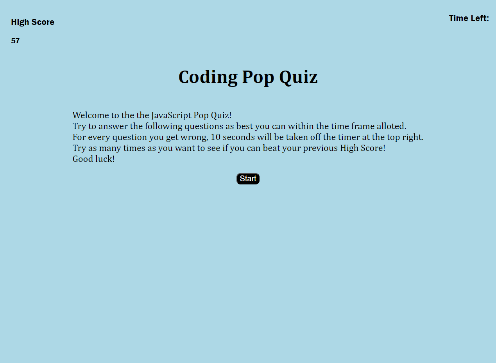

# Pop-Quiz-Coding-Style-4-13-23
## Description

This website was created to give people the opportunity to test their knowledge and understanding of JavaScript. They Take a multiple choice quiz with 5 questions and have 4 different options for each question. Once the quiz is finished it will keep the highest score you have based on how fast you completed the quiz and will post it as your "High Score". Then you have the option to take the quiz again.
## Website Screenshot 

## URL of Deployed Link

https://dmschopler.github.io/Pop-Quiz-Coding-Style-4-13-23/